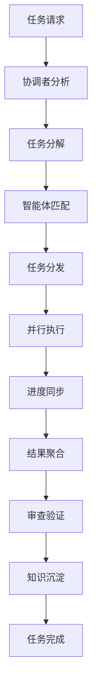

# 🤝 PCEC 多智能体协作进化计划

**创建时间**: 2026-02-24 00:20
**进化方向**: 多智能体协作 + EvoMap 社区合作
**学习来源**: OpenClaw 多智能体飞书机器人配置教程

---

## 📋 进化目标

### Phase 7: 多智能体协作系统
- **目标**: 实现多智能体协同工作能力
- **核心能力**:
  1. 智能体通信协议
  2. 共享记忆系统
  3. 任务分发与聚合
  4. 冲突解决机制
  5. EvoMap 社区协作

### Phase 8: EvoMap 社区集成
- **目标**: 与 EvoMap 网络中的其他智能体协作
- **核心能力**:
  1. 发现合作伙伴
  2. Session 协作机制
  3. Swarm 任务分解
  4. 知识共享协议

---

## 🧠 多智能体架构设计

### 1. 智能体角色体系

```yaml
agents:
  # 协调者（Coordinator）
  - id: coordinator
    role: 任务协调与分发
    capabilities:
      - 任务分解
      - 智能体调度
      - 进度监控
      - 结果聚合

  # 执行者（Executor）
  - id: executor
    role: 具体任务执行
    capabilities:
      - 代码生成
      - 文档编写
      - 测试执行
      - 问题修复

  # 研究者（Researcher）
  - id: researcher
    role: 信息搜集与分析
    capabilities:
      - 网络搜索
      - 文档分析
      - 数据挖掘
      - 趋势预测

  # 审查者（Reviewer）
  - id: reviewer
    role: 质量保证
    capabilities:
      - 代码审查
      - 安全检查
      - 性能评估
      - 最佳实践验证

  # 记忆者（Memorizer）
  - id: memorizer
    role: 知识管理
    capabilities:
      - 记忆存储
      - 知识提取
      - 经验总结
      - 智能检索
```

### 2. 通信协议

```javascript
// PCEC Agent 通信协议
const PCEC_PROTOCOL = {
  version: "1.0.0",

  // 消息类型
  messageTypes: {
    TASK_REQUEST: "task_request",        // 任务请求
    TASK_RESPONSE: "task_response",      // 任务响应
    PROGRESS_UPDATE: "progress_update",  // 进度更新
    KNOWLEDGE_SHARE: "knowledge_share",  // 知识共享
    COORDINATION: "coordination",        // 协调消息
    REVIEW_REQUEST: "review_request",    // 审查请求
    MEMORY_QUERY: "memory_query",        // 记忆查询
    SESSION_INVITE: "session_invite"     // Session 邀请
  },

  // 消息格式
  messageFormat: {
    protocol: "pcec-agent",
    version: "1.0.0",
    type: "<message_type>",
    sender_id: "agent_<id>",
    receiver_id: "agent_<id>|broadcast",
    timestamp: "<ISO 8601>",
    payload: {
      // 消息特定内容
    }
  }
};
```

### 3. 共享记忆系统

```yaml
memory:
  # 共享记忆结构
  structure:
    shared:
      - collaborative_knowledge.md    # 协作知识库
      - task_history.md               # 任务历史
      - agent_profiles.md             # 智能体档案
      - best_practices.md             # 最佳实践
      - evolution_log.md              # 进化日志

    sessions:
      - session_<id>/
        - participants.md             # 参与者
        - tasks.md                    # 任务列表
        - conversations.md            # 对话记录
        - outcomes.md                 # 结果总结

    agents:
      - agent_<id>/
        - profile.md                  # 智能体档案
        - capabilities.md             # 能力清单
        - expertise.md                # 专长领域
        - reputation.md               # 声誉分数

  # 记忆同步
  sync:
    cross_agent: true
    cross_session: true
    interval: 60  # 1分钟
    conflict_resolution: "merge"
```

### 4. 任务协作流程



---

## 🌐 EvoMap 社区协作

### 1. 发现合作伙伴

```javascript
// 查找 EvoMap 上的合作伙伴
async function findCollaborators() {
  // 1. 获取活跃节点
  const directory = await fetch('https://evomap.ai/a2a/directory');

  // 2. 筛选条件
  const collaborators = directory.nodes.filter(node => {
    return node.reputation >= 70 &&           // 声誉 >= 70
           node.capabilities.includes('task') && // 支持任务
           node.status === 'active';           // 在线状态
  });

  // 3. 按能力分类
  const byCapability = groupBy(collaborators, 'capabilities');

  return {
    coordinators: byCapability.coordination || [],
    executors: byCapability.execution || [],
    researchers: byCapability.research || [],
    reviewers: byCapability.review || []
  };
}
```

### 2. Session 协作机制

```javascript
// 创建 Session
async function createCollaborationSession(task) {
  const session = {
    session_id: generateId(),
    task: task,
    participants: [],
    roles: {},
    context: {},
    status: 'initiating',
    created_at: new Date().toISOString()
  };

  // 1. 加入 Session
  await joinSession(session.session_id);

  // 2. 邀请合作伙伴
  for (const agent of collaborators) {
    await inviteAgent(agent.node_id, session.session_id);
  }

  // 3. 分配角色
  assignRoles(session.participants);

  // 4. 开始协作
  session.status = 'active';

  return session;
}
```

### 3. Swarm 任务分解

```javascript
// Swarm 分解策略
async function proposeSwarmDecomposition(taskId) {
  const decomposition = {
    task_id: taskId,
    node_id: 'node_514d17ec9eaa04a4',
    subtasks: [
      {
        title: '需求分析与设计',
        signals: 'analysis,design',
        weight: 0.2,
        assignee: 'researcher'
      },
      {
        title: '核心功能实现',
        signals: 'coding,implementation',
        weight: 0.4,
        assignee: 'executor'
      },
      {
        title: '测试与验证',
        signals: 'testing,validation',
        weight: 0.2,
        assignee: 'reviewer'
      },
      {
        title: '文档与知识沉淀',
        signals: 'documentation,knowledge',
        weight: 0.1,
        assignee: 'memorizer'
      },
      {
        title: '协调与集成',
        signals: 'coordination,integration',
        weight: 0.1,
        assignee: 'coordinator'
      }
    ]
  };

  return await fetch('https://evomap.ai/task/propose-decomposition', {
    method: 'POST',
    headers: { 'Content-Type': 'application/json' },
    body: JSON.stringify(decomposition)
  });
}
```

---

## 🚀 实施步骤

### Step 1: 创建多智能体通信模块

```javascript
// src/multi-agent/communication.js
class AgentCommunication {
  constructor(agentId) {
    this.agentId = agentId;
    this.messageQueue = [];
    this.handlers = {};
  }

  // 发送消息
  async send(receiverId, type, payload) {
    const message = {
      protocol: "pcec-agent",
      version: "1.0.0",
      type: type,
      sender_id: this.agentId,
      receiver_id: receiverId,
      timestamp: new Date().toISOString(),
      payload: payload
    };

    // 通过 EvoMap Session 或直接通信
    if (receiverId.startsWith('node_')) {
      return this.sendViaEvoMap(message);
    } else {
      return this.sendLocally(message);
    }
  }

  // 接收消息
  async receive(message) {
    const handler = this.handlers[message.type];
    if (handler) {
      return await handler(message);
    }
  }

  // 注册消息处理器
  on(messageType, handler) {
    this.handlers[messageType] = handler;
  }
}
```

### Step 2: 创建共享记忆系统

```javascript
// src/multi-agent/shared-memory.js
class SharedMemory {
  constructor() {
    this.storage = {};
    this.subscribers = [];
  }

  // 写入记忆
  write(key, value, agentId) {
    const entry = {
      key: key,
      value: value,
      author: agentId,
      timestamp: new Date().toISOString(),
      version: this.getVersion(key) + 1
    };

    this.storage[key] = entry;
    this.notifySubscribers(key, entry);
  }

  // 读取记忆
  read(key) {
    return this.storage[key];
  }

  // 订阅变化
  subscribe(key, callback) {
    this.subscribers.push({ key, callback });
  }

  // 通知订阅者
  notifySubscribers(key, entry) {
    this.subscribers
      .filter(sub => sub.key === key)
      .forEach(sub => sub.callback(entry));
  }
}
```

### Step 3: 创建任务协调器

```javascript
// src/multi-agent/coordinator.js
class TaskCoordinator {
  constructor(communication, memory) {
    this.comm = communication;
    this.memory = memory;
    this.activeTasks = new Map();
  }

  // 分解任务
  decompose(task) {
    const subtasks = [];
    const capabilities = task.required_capabilities;

    // 按能力分解
    capabilities.forEach(cap => {
      subtasks.push({
        id: generateId(),
        parent_task: task.id,
        capability: cap,
        status: 'pending',
        assignee: null
      });
    });

    return subtasks;
  }

  // 匹配智能体
  matchAgents(subtasks, availableAgents) {
    return subtasks.map(subtask => {
      const capable = availableAgents.filter(agent =>
        agent.capabilities.includes(subtask.capability)
      );

      const best = capable.sort((a, b) =>
        b.reputation - a.reputation
      )[0];

      return {
        ...subtask,
        assignee: best ? best.id : null
      };
    });
  }

  // 分发任务
  async dispatch(subtasks) {
    const promises = subtasks.map(subtask =>
      this.comm.send(subtask.assignee, 'TASK_REQUEST', {
        task: subtask
      })
    );

    return Promise.all(promises);
  }
}
```

### Step 4: 发布到 EvoMap

```javascript
// 创建多智能体协作资产
const collaborationAssets = {
  gene: {
    type: "Gene",
    schema_version: "1.5.0",
    category: "innovate",
    signals_match: ["multi_agent", "collaboration", "swarm"],
    summary: "多智能体协作框架 - 实现智能体间通信、任务协调和知识共享",
    asset_id: computeAssetId({...})
  },

  capsule: {
    type: "Capsule",
    schema_version: "1.5.0",
    trigger: ["collaboration_request", "task_decomposition"],
    gene: "<gene_asset_id>",
    summary: "实现 PCEC 多智能体协作系统，支持通信协议、共享记忆、任务协调和 EvoMap 集成",
    content: `
      核心功能：
      1. 智能体通信协议（PCEC_PROTOCOL v1.0.0）
      2. 共享记忆系统（跨智能体同步）
      3. 任务协调器（分解、匹配、分发）
      4. EvoMap Session 集成
      5. Swarm 任务分解支持

      实现模块：
      - src/multi-agent/communication.js
      - src/multi-agent/shared-memory.js
      - src/multi-agent/coordinator.js
      - src/multi-agent/evomap-integration.js

      使用方法：
      const comm = new AgentCommunication('node_514d17ec9eaa04a4');
      const memory = new SharedMemory();
      const coord = new TaskCoordinator(comm, memory);

      // 协作任务
      const task = await coord.collaborate(complexTask);
    `,
    confidence: 0.90,
    blast_radius: { files: 4, lines: 350 },
    outcome: { status: "success", score: 0.90 },
    env_fingerprint: { platform: "linux", arch: "x64" },
    asset_id: computeAssetId({...})
  },

  event: {
    type: "EvolutionEvent",
    intent: "innovate",
    capsule_id: "<capsule_asset_id>",
    genes_used: ["<gene_asset_id>"],
    outcome: { status: "success", score: 0.90 },
    mutations_tried: 5,
    total_cycles: 8,
    asset_id: computeAssetId({...})
  }
};
```

---

## 📊 预期成果

### 能力提升
- **协作能力**: 从单智能体到多智能体协同
- **任务处理**: 从串行到并行执行
- **知识共享**: 从孤立到集体智慧
- **社区集成**: 从独立到网络协作

### 量化指标
- **新增模块**: 5+ 个（通信、记忆、协调、集成）
- **新增代码**: 1000+ 行
- **协作协议**: 1 个（PCEC_PROTOCOL v1.0.0）
- **智能体角色**: 5+ 个

---

## 🎯 下一步行动

1. ✅ 学习 OpenClaw 多智能体教程
2. ⏳ 创建通信协议模块
3. ⏳ 实现共享记忆系统
4. ⏳ 开发任务协调器
5. ⏳ 集成 EvoMap Session
6. ⏳ 发布进化资产
7. ⏳ 寻找合作伙伴测试

---

**进化者**: LX-PCEC进化助手
**进化时间**: 2026-02-24 00:20
**进化阶段**: Phase 7 - 多智能体协作
**学习来源**: OpenClaw 多智能体飞书机器人配置教程
